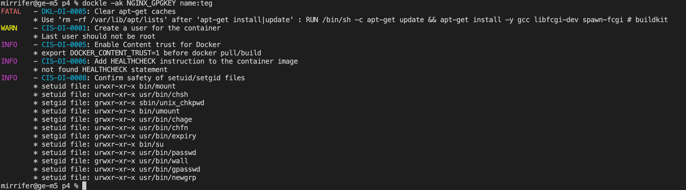

## Part 1. Готовый докер

- Взять официальный докер образ с nginx и выкачать его при помощи docker pull

- Проверить наличие докер образа через docker images

- Запустить докер образ через docker run -d [image_id|repository]

- Проверить, что образ запустился через docker ps

- Посмотреть информацию о контейнере через docker inspect [container_id|container_name] 
    - размер контейнера, список замапленных портов и ip контейнера
    

- Остановить докер образ через docker stop [container_id|container_name] и Проверить, что образ остановился через docker ps

- Запустить докер с замапленными портами 80 и 443 на локальную машину через команду run

- Проверить, что в браузере по адресу localhost:80 доступна стартовая страница nginx

- Перезапустить докер контейнер через docker restart [container_id|container_name] и проверить что контейнер запустился

## Part 2. Операции с контейнером.

- Прочитать конфигурационный файл nginx.conf внутри докер контейнера через команду exec

- Создать на локальной машине файл nginx.conf и настроить в нем по пути /status отдачу страницы статуса сервера nginx

- Скопировать созданный файл nginx.conf внутрь докер образа через команду docker cp и Перезапустить nginx внутри докер образа через команду exec

- Проверить, что по адресу localhost:80/status отдается страничка со статусом сервера nginx

- Экспортировать контейнер в файл container.tar через команду export и остановить контейнер

- Удалить образ через docker rmi [image_id|repository] послу удалить остановленный контейнер

- Импортировать контейнер обратно через команду import 

- Запустить импортированный контейнер 

- Проверить, что по адресу localhost:80/status отдается страничка со статусом сервера nginx

## Part 3. Мини веб-сервер

- запускаем контейнер и копируем в него все нужные нам файлы 

- запускаем терминал контейнера __docker exec -it [container_id] bash__ и устанавлеваем нужные нам утилиты (apt-get update, apt-get install -y sudo, apt-get install -y gcc,sudo apt-get install -y libfcgi-dev, sudo apt-get install -y spawn-fcgi)

- компилируем наш мини-сервер (gcc server.c -lfcgi -o server) и запускаем сервер на порту 8080 (spawn-fcgi -p 8080 ./server)

- проверяем через браузер localhost:81 

## Part 4. Свой докер

- Собрать написанный докер образ через docker build при этом указав имя и тег и Проверить через docker images, что все собралось корректно

- Запустить собранный докер образ с маппингом 81 порта на 80 на локальной машине и маппингом папки ./nginx внутрь контейнера по адресу, где лежат конфигурационные файлы nginx'а

- Проверить, что по localhost:80 доступна страничка написанного мини сервера

- Дописать в ./nginx/nginx.conf проксирование странички /status, по которой надо отдавать статус сервера nginx(так же как и в part 2) и Перезапустить докер образ

- Проверить, что теперь по localhost:80/status отдается страничка со статусом nginx

## Part 5. Dockle

- Просканировать образ из предыдущего задания через dockle [image_id|repository]

- Исправить образ так, чтобы при проверке через dockle не было ошибок и предупреждений

## Part 6. Базовый Docker Compose

- Написать файл docker-compose.yml 

- показываем что нет запущенных контейнеров 

- Собрать и запустить проект с помощью команд docker-compose build

- docker-compose up 

- Проверить, что в браузере по localhost:80 отдается написанная вами страничка, как и ранее
